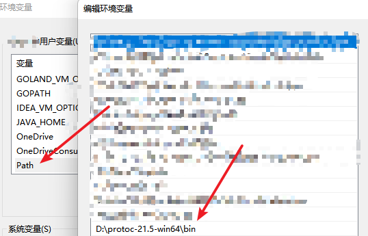

# iogame-unity

在线文档 https://www.yuque.com/iohao/game/syv5mm

## 介绍
- iogame-unity 示例

## Unity
- unity版本
- 2021.3.4f1c1 

## WebSocket
- webScoket使用的: [https://github.com/psygames/UnityWebSocket](https://github.com/psygames/UnityWebSocket)

## Proto
- proto 编译的版本为 protoc-21.5 
- Assets/Plugins 里面放入的是从编译好的 proto c# 依赖，直接复制使用即可

### 编译Proto
- proto 编译需要从 github 下载编译器 [https://github.com/protocolbuffers/protobuf/releases](https://github.com/protocolbuffers/protobuf/releases)
- win64编译器 [https://github.com/protocolbuffers/protobuf/releases/download/v21.5/protoc-21.5-win64.zip](https://github.com/protocolbuffers/protobuf/releases/download/v21.5/protoc-21.5-win64.zip)
- 需要自行配置环境变量,否则下面脚本无法执行。
- 

- build.bat 此脚本用于编译当前脚本目录下的所有 *.proto 文件，编译保存后的目录为上一层的 entity 目录
